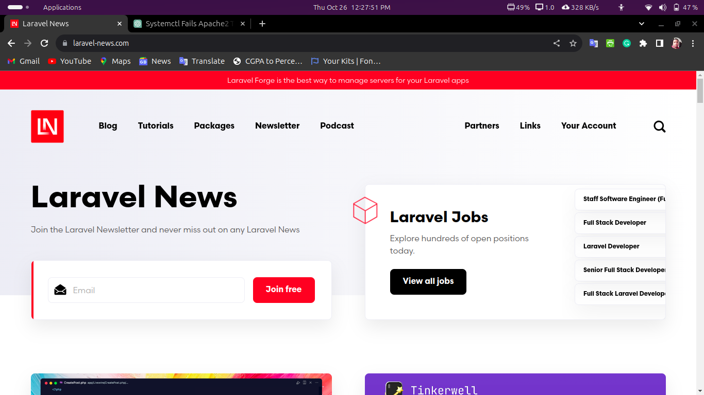

The objective of this task is to provision two Ubuntu-based servers, automating the deployment of a LAMP stack on the "Master" server using a bash script, executing this script on the "Slave" server using an Ansible playbook, and creating a cron job to check server uptime. Here's a step-by-step guide on how I achieved this objective:

 *Setting up a Vagrant Environment
 I created a new directory for the task and I navigated to the directory.
 I created a Vagrantfile Initializing a Vagrant environment and configuring two Ubuntu VMs (Master and Slave).
 Ran 'vagrant up' to create and provision the VMs. I also ensured that they were up and runing.

 *Creating a Bash Deployment Script for the Master Node
 I created a bash script named "laravel.sh" for the Master node. This script was used to  install and configure the LAMP stack, clone PHP application from GitHub, and set up Apache and MySQL.
 I Saved the laravel.sh script in the same directory as my Vagrantfile.

 *Creating an Ansible Playbook for the Slave Node
 I Created an Ansible playbook named "playbook.yml" that will run the laravel.sh script on the Slave node. Also, I  included a task to create a cron job for checking server uptime.
 I Saved the playbook.yml in the same directory as my Vagrantfile.

 *Execution of the Ansible Playbook
 I Provisioned the VMs again with" vagrant up" to ensure they are running and in a good state.
 I used Ansible to execute the playbook on the Slave node
 

  

 *Verification of the Application's Accessibility (On the Master and Slave Node)
 - On the Master Node
 To access the PHP application on the master node, I opened a web browser and used the Master IP address
  (192.168.56.8) to check for the accessibility. The PHP application ran successfully.
 
 
 
 

  

- On the Slave Node
 To access the PHP application on the slave node, I opened a web browser and used the Slave IP address
  (192.168.56.9) to check for the accessibility. The PHP application ran successfully.
 
 
 
 

  

 *Uptime Records
 I Checked the /vagrant/uptime.log file on the "slave" server for uptime records
 

 I successfully automated the deployment of LAMP stack on the "Master" server using a bash script, I also executed the script on the "Slave" server using an Ansible playbook, and created a cron job to check server uptime.